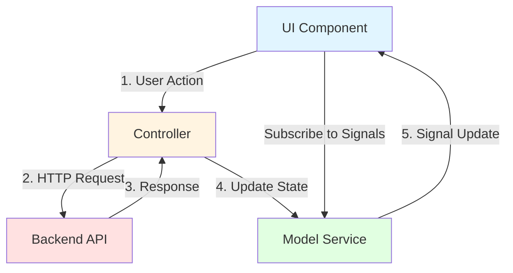

# Controller and Model Design Pattern

## Overview

The Angular frontend follows a unidirectional data flow pattern using a **Controller-Model-View** architecture. This pattern separates concerns and provides a clear flow of data through the application.

## Architecture Components

### 1. **Model Service** (`model.service.ts`)
The Model Service is the single source of truth for application state. It:
- Stores data using Angular signals (writable signals internally)
- Exposes readonly signals to components
- Provides setter methods to update the state
- Does NOT communicate with the backend directly

### 2. **Controller** (`controller.ts`)
The Controller orchestrates write operations and backend communication. It:
- Handles all HTTP requests to the backend
- Processes responses and errors
- Updates the Model Service with new data
- Provides methods for CRUD operations

### 3. **UI Components**
Components consume data and trigger actions. They:
- Subscribe to signals from the Model Service to display data
- Use `effect()` to react to signal changes
- Call Controller methods to perform write operations
- Do NOT make HTTP calls directly

## Data Flow



## Detailed Flow

1. **User Action**: User interacts with the UI (e.g., clicks "Create Demo Item")
2. **Controller Invocation**: Component calls a Controller method (e.g., `controller.createDemo()`)
3. **Backend Communication**: Controller makes HTTP request to the backend
4. **Response Processing**: Controller receives response or error
5. **Model Update**: Controller updates Model Service with new data (e.g., `modelService.setDemos(demos)`)
6. **Signal Emission**: Model Service updates its signals
7. **UI Reaction**: Components automatically re-render based on signal changes

## Example: Demo CRUD Operations

### Model Service
```typescript
@Injectable({ providedIn: 'root' })
export class ModelService {
  private demos = signal<Demo[]>([]);
  demos$: Signal<Demo[]> = this.demos.asReadonly();
  
  setDemos(demos: Demo[]) {
    this.demos.set(demos);
  }
}
```

### Controller
```typescript
@Injectable({ providedIn: 'root' })
export class Controller {
  private modelService = inject(ModelService);
  private http = inject(HttpClient);
  
  loadDemos() {
    this.http.get<Demo[]>('/api/demo').subscribe({
      next: (demos) => this.modelService.setDemos(demos),
      error: (err) => console.error('Error loading demos:', err)
    });
  }
  
  async createDemo(): Promise<Demo> {
    const demo = await firstValueFrom(
      this.http.post<Demo>('/api/demo', {})
    );
    this.loadDemos(); // Refresh the list
    return demo;
  }
}
```

### Component
```typescript
@Component({ ... })
export class DemoComponent implements OnInit {
  private modelService = inject(ModelService);
  private controller = inject(Controller);
  
  demos: Signal<Demo[]> = this.modelService.demos$;
  
  ngOnInit() {
    this.controller.loadDemos();
  }
  
  async onCreate() {
    await this.controller.createDemo();
    // UI automatically updates via signal
  }
}
```

## Benefits

1. **Separation of Concerns**: Clear boundaries between data, logic, and presentation
2. **Testability**: Easy to mock Controller and Model Service in tests
3. **Predictable State**: Single source of truth prevents state inconsistencies
4. **Reactive UI**: Signals automatically trigger UI updates
5. **Maintainability**: Changes to backend communication only affect Controller

## Best Practices

1. **Never bypass the pattern**: Components should not make HTTP calls directly
2. **Keep Model Service pure**: No business logic or HTTP calls in Model Service
3. **Controller handles errors**: Process and log errors before updating Model
4. **Use readonly signals**: Prevent components from directly mutating state
5. **Reload after mutations**: After create/update/delete, reload data to ensure consistency

## Anti-Patterns to Avoid

❌ **Don't**: Make HTTP calls directly in components
❌ **Don't**: Put business logic in Model Service
❌ **Don't**: Expose writable signals to components
❌ **Don't**: Skip the Controller for backend operations
❌ **Don't**: Write to the Model Service directly from components without going through the Controller
❌ **Don't**: Manually trigger change detection (signals handle this)

