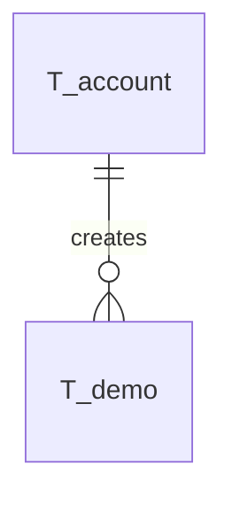

# Database Model Documentation

## Overview

The Abstradex database stores partner information for SMEs, including customers, suppliers, and other business contacts. The data model is designed to be simple yet extensible, supporting basic contact management with room for future enhancements.

The schema is compatible with both MySQL and H2 databases and follows a naming convention where all tables are prefixed with `T_`, foreign keys with `FK_`, and indices with `I_`.

## Entity Relationship Diagram



## Table Descriptions

### T_account

The `T_account` table stores user account information for authentication and authorization.

**Key Features:**
- Stores user identity and authentication details
- Links to OIDC authentication provider
- Tracks account creation and modification

**Constraints:**
- Primary key: `id` (VARCHAR(36) UUID)
- Unique constraint on username/email

**Indices:**
- Primary key index on `id`
- Unique index on username/email fields

**Relationships:**
- One account can create many demo records

**Security Features:**
- Integrates with OIDC authentication
- No passwords stored locally (delegated to abstrauth)

### T_demo

The `T_demo` table stores partner/contact information (customers, suppliers, etc.).

**Important:** This is the main business entity table for the application. Currently named "demo" as a placeholder - will be renamed to "partner" or similar in future iterations.

**Key Features:**
- Stores partner contact details
- Tracks creation and modification metadata
- Supports full CRUD operations

**Constraints:**
- Primary key: `id` (auto-increment or UUID)
- Foreign key to `T_account` for creator tracking

**Indices:**
- Primary key index
- Index on account_id for efficient filtering
- Index on name for search operations

**Relationships:**
- Links to account via `account_id` (creator/owner)

**Default Data:**
- Sample demo records created via migration scripts for testing

## Naming Conventions

The database follows strict naming conventions for consistency and clarity:

- **Tables**: Prefixed with `T_` (e.g., `T_accounts`, `T_oauth_clients`)
- **Foreign Keys**: Format `FK_<tableName>_<columnName>` (e.g., `FK_credentials_account_id`)
- **Indices**: Format `I_<tableName>_<columnName(s)>` (e.g., `I_accounts_email`)
- **Primary Keys**: Always named `id` using VARCHAR(36) for UUID storage
- **Timestamps**: Use `created_at` and `expires_at` naming pattern

## Data Flow

1. **User Authentication**: Users authenticate via OIDC (abstrauth), creating/updating records in `T_account`
2. **Partner Management**: Authenticated users create, read, update, and delete partner records in `T_demo`
3. **Audit Trail**: All records track creator and timestamps for audit purposes

## Database Compatibility

The schema is designed to work with both MySQL and H2 databases:

- Uses standard SQL data types
- Avoids database-specific features
- Named constraints for explicit control
- Separate CREATE INDEX statements for compatibility
- BOOLEAN type supported by both databases
- VARCHAR lengths within common limits

## Indexes and Performance

Strategic indexes are placed for common query patterns:

- **Unique Indexes**: Enforce business rules (email, username, client_id, code)
- **Composite Indexes**: Support multi-column queries (client_id + account_id)
- **Expiration Indexes**: Enable efficient cleanup of expired records
- **Foreign Key Indexes**: Implicit indexes on FK columns for join performance

## Security Considerations

- **Password Storage**: Only hashed passwords stored, never plaintext
- **Expiration**: All temporary entities have expiration timestamps
- **Cascade Deletes**: Automatic cleanup of related records
- **One-Time Codes**: Authorization codes can only be used once

## Maintenance

### Cleanup Queries

Expired records should be periodically cleaned:

Currently, the demo table does not have expiration-based records. Future enhancements may include:

```sql
-- Example: Clean soft-deleted records older than 90 days
-- DELETE FROM T_demo 
-- WHERE deleted_at < DATE_SUB(CURRENT_TIMESTAMP, INTERVAL 90 DAY);

### Monitoring Queries

Useful monitoring queries:

```sql
-- Count partners by account
SELECT account_id, COUNT(*) as partner_count
FROM T_demo
GROUP BY account_id
ORDER BY partner_count DESC;

-- Recent activity
SELECT *
FROM T_demo
WHERE created_at > DATE_SUB(CURRENT_TIMESTAMP, INTERVAL 7 DAY)
ORDER BY created_at DESC;
```

