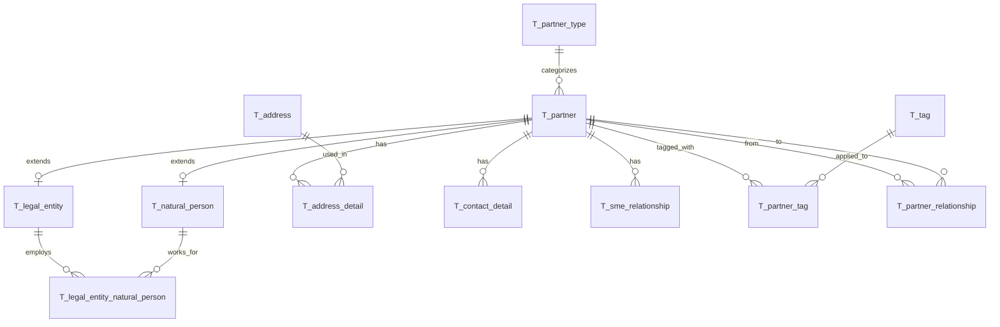

# Database Model Documentation

## Overview

The Abstradex database implements a comprehensive partner management system for SMEs, including customers, suppliers, and other business contacts. The data model supports:

- **Partner Management**: Natural persons and legal entities
- **Address Management**: Multiple addresses per partner with type classification
- **Contact Management**: Multiple contact methods (email, phone, etc.)
- **Relationship Tracking**: Partner-to-partner relationships and SME-specific relationships
- **Tagging System**: Flexible categorization of partners

The schema is compatible with MySQL, PostgreSQL, H2, and MS SQL databases and follows a naming convention where all tables are prefixed with `T_`.

## Entity Relationship Diagram



## Core Tables

### T_partner_type

Lookup table for partner types (Natural Person or Legal Entity).

**Columns:**
- `id` VARCHAR(36) PRIMARY KEY - UUID identifier
- `type_code` VARCHAR(50) NOT NULL UNIQUE - Type code (NATURAL_PERSON, LEGAL_ENTITY)
- `description` VARCHAR(255) - Human-readable description

**Indices:**
- Primary key on `id`
- Unique index on `type_code`

**Default Data:**
- NATURAL_PERSON: Individual person or natural person
- LEGAL_ENTITY: Company, organization, or legal entity

---

### T_partner

Base table for all partners (customers, suppliers, business contacts).

**Columns:**
- `id` VARCHAR(36) PRIMARY KEY - UUID identifier
- `partner_number_seq` BIGINT NOT NULL UNIQUE - Sequential partner number
- `partner_type_id` VARCHAR(36) - Foreign key to T_partner_type
- `active` BOOLEAN NOT NULL DEFAULT TRUE - Active status
- `notes` TEXT - General notes about the partner
- `created_at` TIMESTAMP - Creation timestamp
- `updated_at` TIMESTAMP - Last update timestamp

**Constraints:**
- Foreign key to `T_partner_type(id)`

**Indices:**
- Primary key on `id`
- Unique index on `partner_number_seq`
- Index on `partner_type_id`
- Index on `active`
- Index on `created_at`

**Partner Number Generation:**
- Uses application-managed sequence via `T_partner_sequence` table
- Format: P000001, P000002, etc.

---

### T_partner_sequence

Tracks the next available partner number for sequential numbering.

**Columns:**
- `id` INT PRIMARY KEY - Always 1 (single row table)
- `next_val` BIGINT NOT NULL - Next partner number to assign

**Usage:**
- Application code reads and increments this value atomically
- Ensures unique, sequential partner numbers across all database types

---

### T_natural_person

Extends T_partner for individual persons.

**Columns:**
- `partner_id` VARCHAR(36) PRIMARY KEY - Foreign key to T_partner(id)
- `first_name` VARCHAR(100) - First name
- `last_name` VARCHAR(100) - Last name
- `middle_name` VARCHAR(100) - Middle name
- `title` VARCHAR(50) - Title (Mr., Mrs., Dr., etc.)
- `date_of_birth` DATE - Date of birth
- `tax_id` VARCHAR(50) - Tax identification number
- `preferred_language` VARCHAR(10) - ISO language code

**Constraints:**
- Foreign key to `T_partner(id)` with CASCADE delete

**Indices:**
- Primary key on `partner_id`
- Index on `last_name`
- Index on `first_name`
- Index on `tax_id`

---

### T_legal_entity

Extends T_partner for companies and organizations.

**Columns:**
- `partner_id` VARCHAR(36) PRIMARY KEY - Foreign key to T_partner(id)
- `legal_name` VARCHAR(255) - Official legal name
- `trading_name` VARCHAR(255) - Trading/DBA name
- `registration_number` VARCHAR(100) - Company registration number
- `tax_id` VARCHAR(50) - Tax identification number
- `legal_form` VARCHAR(100) - Legal form (LLC, Corp, etc.)
- `incorporation_date` DATE - Date of incorporation
- `jurisdiction` VARCHAR(100) - Jurisdiction of incorporation

**Constraints:**
- Foreign key to `T_partner(id)` with CASCADE delete

**Indices:**
- Primary key on `partner_id`
- Index on `legal_name`
- Index on `trading_name`
- Index on `registration_number`
- Index on `tax_id`

---

### T_legal_entity_natural_person

Junction table linking legal entities to natural persons (employment/representation).

**Columns:**
- `legal_entity_id` VARCHAR(36) NOT NULL - Foreign key to T_legal_entity
- `natural_person_id` VARCHAR(36) NOT NULL - Foreign key to T_natural_person
- `PRIMARY KEY (legal_entity_id, natural_person_id)` - Composite primary key

**Constraints:**
- Foreign key to `T_legal_entity(partner_id)` with CASCADE delete
- Foreign key to `T_natural_person(partner_id)` with CASCADE delete

**Indices:**
- Composite primary key on `(legal_entity_id, natural_person_id)`
- Index on `natural_person_id`

**Use Cases:**
- Employees of a company
- Authorized representatives
- Board members

---

## Address Management

### T_address

Stores physical addresses (reusable across partners).

**Columns:**
- `id` VARCHAR(36) PRIMARY KEY - UUID identifier
- `street_line1` VARCHAR(255) - Street address line 1
- `street_line2` VARCHAR(255) - Street address line 2
- `city` VARCHAR(100) - City
- `state_province` VARCHAR(100) - State or province
- `postal_code` VARCHAR(20) - Postal/ZIP code
- `country_code` VARCHAR(2) - ISO 3166-1 alpha-2 country code
- `valid_from` TIMESTAMP - Validity start date
- `valid_to` TIMESTAMP - Validity end date
- `is_verified` BOOLEAN NOT NULL DEFAULT FALSE - Verification status

**Indices:**
- Primary key on `id`
- Index on `city`
- Index on `postal_code`
- Index on `country_code`
- Index on `is_verified`
- Composite index on `(valid_from, valid_to)`

**Design Notes:**
- Addresses are shared entities (one address can be used by multiple partners)
- Validity period supports temporal address management
- Verification flag for address validation

---

### T_address_detail

Links partners to addresses with additional metadata.

**Columns:**
- `id` VARCHAR(36) PRIMARY KEY - UUID identifier
- `partner_id` VARCHAR(36) NOT NULL - Foreign key to T_partner
- `address_id` VARCHAR(36) NOT NULL - Foreign key to T_address
- `is_primary` BOOLEAN NOT NULL DEFAULT FALSE - Primary address flag
- `address_type` VARCHAR(50) - Type: BILLING or SHIPPING
- `valid_from` TIMESTAMP - Validity start date
- `valid_to` TIMESTAMP - Validity end date

**Constraints:**
- Foreign key to `T_partner(id)` with CASCADE delete
- Foreign key to `T_address(id)` with CASCADE delete
- CHECK constraint: `address_type IN ('BILLING', 'SHIPPING')`

**Indices:**
- Primary key on `id`
- Index on `partner_id`
- Index on `address_id`
- Composite index on `(partner_id, is_primary)`
- Index on `address_type`
- Composite index on `(valid_from, valid_to)`

**Business Rules:**
- A partner can have multiple addresses
- One address can be marked as primary
- Addresses can be typed as BILLING or SHIPPING
- Validity period supports temporal tracking

---

## Contact Management

### T_contact_detail

Stores contact information for partners (email, phone, etc.).

**Columns:**
- `id` VARCHAR(36) PRIMARY KEY - UUID identifier
- `partner_id` VARCHAR(36) NOT NULL - Foreign key to T_partner
- `contact_type` VARCHAR(50) - Type of contact
- `contact_value` VARCHAR(255) - Contact value (email, phone number, etc.)
- `label` VARCHAR(100) - Label (Home, Work, Mobile, etc.)
- `is_primary` BOOLEAN NOT NULL DEFAULT FALSE - Primary contact flag
- `is_verified` BOOLEAN NOT NULL DEFAULT FALSE - Verification status

**Constraints:**
- Foreign key to `T_partner(id)` with CASCADE delete
- CHECK constraint: `contact_type IN ('EMAIL', 'PHONE', 'MOBILE', 'FAX', 'WEBSITE', 'LINKEDIN', 'OTHER')`

**Indices:**
- Primary key on `id`
- Index on `partner_id`
- Index on `contact_type`
- Composite index on `(partner_id, is_primary)`
- Index on `is_verified`
- Index on `contact_value`

**Supported Contact Types:**
- EMAIL: Email address
- PHONE: Landline phone number
- MOBILE: Mobile phone number
- FAX: Fax number
- WEBSITE: Website URL
- LINKEDIN: LinkedIn profile
- OTHER: Other contact methods

---

## Relationship Management

### T_sme_relationship

Tracks SME-specific relationships (customer/supplier status).

**Columns:**
- `id` VARCHAR(36) PRIMARY KEY - UUID identifier
- `partner_id` VARCHAR(36) NOT NULL - Foreign key to T_partner
- `relationship_type` VARCHAR(50) - Type: CUSTOMER, SUPPLIER, or BOTH
- `status` VARCHAR(50) - Status of relationship
- `relationship_start` DATE - Start date
- `relationship_end` DATE - End date
- `payment_terms` VARCHAR(255) - Payment terms
- `credit_limit` VARCHAR(50) - Credit limit
- `priority_level` INT - Priority level (1-5)
- `account_manager` VARCHAR(100) - Account manager name

**Constraints:**
- Foreign key to `T_partner(id)` with CASCADE delete
- CHECK constraint: `relationship_type IN ('CUSTOMER', 'SUPPLIER', 'BOTH')`
- CHECK constraint: `status IN ('ACTIVE', 'INACTIVE', 'PROSPECT', 'FORMER', 'SUSPENDED')`

**Indices:**
- Primary key on `id`
- Index on `partner_id`
- Index on `relationship_type`
- Index on `status`
- Index on `account_manager`
- Composite index on `(relationship_start, relationship_end)`

**Relationship Types:**
- CUSTOMER: Partner is a customer
- SUPPLIER: Partner is a supplier
- BOTH: Partner is both customer and supplier

**Status Values:**
- ACTIVE: Currently active relationship
- INACTIVE: Temporarily inactive
- PROSPECT: Potential future relationship
- FORMER: Past relationship
- SUSPENDED: Suspended relationship

---

### T_partner_relationship

Tracks partner-to-partner relationships (parent company, employee, etc.).

**Columns:**
- `id` VARCHAR(36) PRIMARY KEY - UUID identifier
- `from_partner_id` VARCHAR(36) NOT NULL - Source partner
- `to_partner_id` VARCHAR(36) NOT NULL - Target partner
- `relationship_type` VARCHAR(100) - Type of relationship
- `effective_from` DATE - Effective start date
- `effective_to` DATE - Effective end date
- `notes` TEXT - Additional notes

**Constraints:**
- Foreign key to `T_partner(id)` for `from_partner_id` with CASCADE delete
- Foreign key to `T_partner(id)` for `to_partner_id` with CASCADE delete
- CHECK constraint: `relationship_type IN ('PARENT_COMPANY', 'SUBSIDIARY', 'EMPLOYEE', 'AUTHORIZED_REP', 'BUSINESS_PARTNER', 'REFERRAL', 'AFFILIATED', 'OTHER')`
- CHECK constraint: `from_partner_id != to_partner_id` (prevent self-relationships)

**Indices:**
- Primary key on `id`
- Index on `from_partner_id`
- Index on `to_partner_id`
- Index on `relationship_type`
- Composite index on `(effective_from, effective_to)`
- Composite index on `(from_partner_id, to_partner_id)` for bidirectional queries

**Relationship Types:**
- PARENT_COMPANY: Parent company relationship
- SUBSIDIARY: Subsidiary relationship
- EMPLOYEE: Employment relationship
- AUTHORIZED_REP: Authorized representative
- BUSINESS_PARTNER: Business partnership
- REFERRAL: Referral source
- AFFILIATED: Affiliated entity
- OTHER: Other relationship types

---

## Tagging System

### T_tag

Stores reusable tags for categorizing partners.

**Columns:**
- `id` VARCHAR(36) PRIMARY KEY - UUID identifier
- `tag_name` VARCHAR(100) NOT NULL UNIQUE - Tag name
- `color_hex` VARCHAR(7) - Hex color code for UI display
- `description` VARCHAR(255) - Tag description

**Indices:**
- Primary key on `id`
- Unique index on `tag_name`

**Use Cases:**
- Categorization (VIP, New, Inactive, etc.)
- Industry classification
- Custom business categories

---

### T_partner_tag

Junction table linking partners to tags.

**Columns:**
- `id` VARCHAR(36) PRIMARY KEY - UUID identifier
- `partner_id` VARCHAR(36) NOT NULL - Foreign key to T_partner
- `tag_id` VARCHAR(36) NOT NULL - Foreign key to T_tag
- `tagged_at` TIMESTAMP - When tag was applied
- `tagged_by` VARCHAR(100) - Who applied the tag

**Constraints:**
- Foreign key to `T_partner(id)` with CASCADE delete
- Foreign key to `T_tag(id)` with CASCADE delete
- UNIQUE constraint on `(partner_id, tag_id)` - prevent duplicate tags

**Indices:**
- Primary key on `id`
- Index on `partner_id`
- Index on `tag_id`
- Index on `tagged_at`
- Index on `tagged_by`
- Unique composite index on `(partner_id, tag_id)`

---

## Naming Conventions

The database follows strict naming conventions for consistency:

- **Tables**: Prefixed with `T_` (e.g., `T_partner`, `T_address`)
- **Foreign Keys**: Named `fk_<table>_<column>` (e.g., `fk_address_detail_partner`)
- **Check Constraints**: Named `chk_<column>` (e.g., `chk_address_type`)
- **Unique Constraints**: Named `uq_<table>_<column(s)>` (e.g., `uq_partner_tag`)
- **Indices**: Named `idx_<table>_<column(s)>` (e.g., `idx_partner_active`)
- **Primary Keys**: Always named `id` using VARCHAR(36) for UUID storage
- **Timestamps**: Use `created_at`, `updated_at`, `valid_from`, `valid_to` naming pattern
- **Boolean Flags**: Prefixed with `is_` (e.g., `is_primary`, `is_verified`)

---

## Data Flow

### Partner Creation Flow

1. **Create Partner**: Insert into `T_partner` with auto-generated partner number
2. **Extend Type**: Insert into `T_natural_person` OR `T_legal_entity`
3. **Add Addresses**: Insert into `T_address` (if new) and `T_address_detail`
4. **Add Contacts**: Insert into `T_contact_detail`
5. **Set Relationships**: Insert into `T_sme_relationship` or `T_partner_relationship`
6. **Apply Tags**: Insert into `T_partner_tag`

### Partner Search Flow

1. **Search Partners**: Query `T_partner` with joins to type tables
2. **Load Addresses**: Join through `T_address_detail` to `T_address`
3. **Load Contacts**: Join to `T_contact_detail`
4. **Load Tags**: Join through `T_partner_tag` to `T_tag`

---

## Database Compatibility

The schema is designed to work with MySQL, PostgreSQL, H2, and MS SQL:

- Uses standard SQL data types
- Avoids database-specific features
- Named constraints for explicit control
- Separate CREATE INDEX statements for compatibility
- BOOLEAN type supported by all target databases
- VARCHAR lengths within common limits
- UUID() function replaced with application-generated UUIDs

---

## Performance Considerations

### Strategic Indexing

- **Primary Keys**: All tables have UUID primary keys
- **Foreign Keys**: Indexed for efficient joins
- **Search Fields**: Names, numbers, and codes are indexed
- **Composite Indexes**: Multi-column queries optimized
- **Temporal Queries**: Validity date ranges indexed

### Query Patterns

Common query patterns optimized by indexes:

```sql
-- Find partner by number
SELECT * FROM T_partner WHERE partner_number_seq = ?;

-- Search partners by name
SELECT * FROM T_natural_person WHERE last_name LIKE ?;
SELECT * FROM T_legal_entity WHERE legal_name LIKE ?;

-- Get partner addresses
SELECT a.* FROM T_address a
JOIN T_address_detail ad ON a.id = ad.address_id
WHERE ad.partner_id = ? AND ad.is_primary = TRUE;

-- Find active customers
SELECT p.* FROM T_partner p
JOIN T_sme_relationship sr ON p.id = sr.partner_id
WHERE sr.relationship_type = 'CUSTOMER' AND sr.status = 'ACTIVE';
```

---

## Security Considerations

- **Cascade Deletes**: Automatic cleanup of related records when partner is deleted
- **Data Validation**: CHECK constraints enforce valid values
- **Unique Constraints**: Prevent duplicate data
- **Temporal Data**: Validity periods support audit and compliance
- **Verification Flags**: Track verified addresses and contacts

---

## Maintenance

### Cleanup Queries

```sql
-- Find partners with no addresses
SELECT p.* FROM T_partner p
LEFT JOIN T_address_detail ad ON p.id = ad.partner_id
WHERE ad.id IS NULL;

-- Find expired addresses
SELECT * FROM T_address
WHERE valid_to < CURRENT_TIMESTAMP;

-- Find inactive partners
SELECT * FROM T_partner WHERE active = FALSE;
```

### Monitoring Queries

```sql
-- Partner count by type
SELECT pt.type_code, COUNT(*) as count
FROM T_partner p
JOIN T_partner_type pt ON p.partner_type_id = pt.id
GROUP BY pt.type_code;

-- Active customer/supplier counts
SELECT relationship_type, status, COUNT(*) as count
FROM T_sme_relationship
GROUP BY relationship_type, status;

-- Most used tags
SELECT t.tag_name, COUNT(*) as usage_count
FROM T_tag t
JOIN T_partner_tag pt ON t.id = pt.tag_id
GROUP BY t.tag_name
ORDER BY usage_count DESC;
```

---

## Future Enhancements

Potential future additions to the schema:

- **Audit Tables**: Track all changes to partner data
- **Document Management**: Link documents to partners
- **Communication History**: Track emails, calls, meetings
- **Contract Management**: Store contract details
- **Financial Data**: Payment history, invoices, credit notes
- **GDPR Compliance**: Data retention policies, consent tracking
- **Multi-tenancy**: Support for multiple organizations
