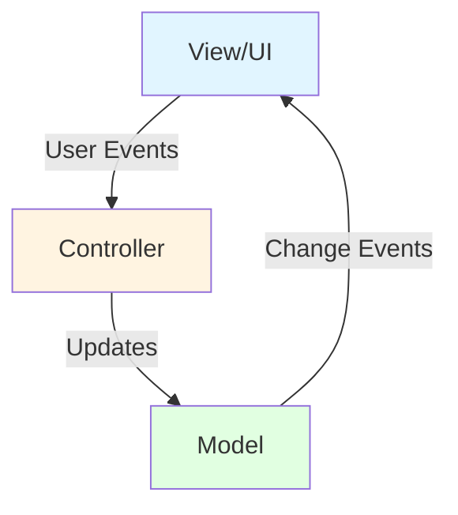
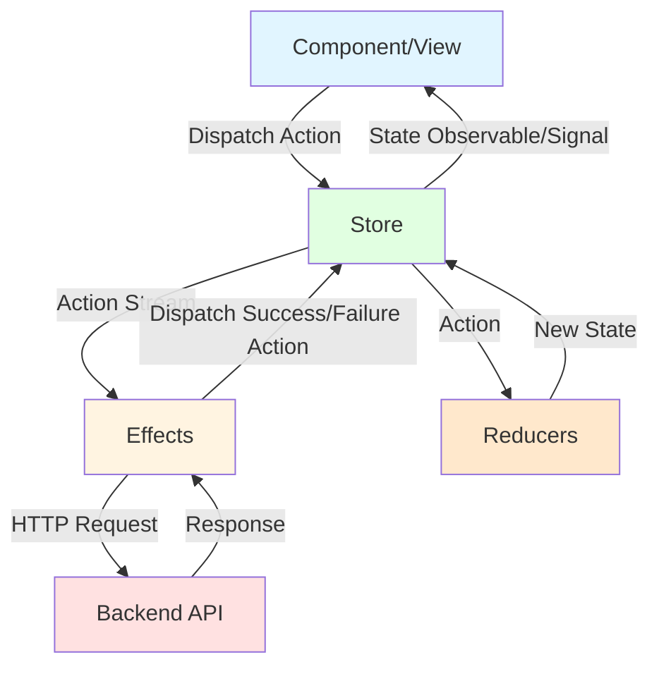

# NgRx Guide: Understanding Redux State Management in Angular

## Overview

NgRx is a reactive state management library for Angular applications, inspired by Redux. It provides a structured approach to managing application state using RxJS observables and, more recently, Angular signals.

## NgRx Core Concepts

### 1. **Store**
The Store is the single source of truth for application state. It:
- Holds the entire application state as an immutable object
- Provides observables (or signals) that components can subscribe to
- Only accepts state changes through dispatched actions
- Similar to: **Model Service** in the Controller-Model pattern

### 2. **Actions**
Actions are events that describe something that happened in the application. They:
- Are plain objects with a `type` property and optional payload
- Represent user interactions, API responses, or other events
- Are dispatched to the store to trigger state changes
- Similar to: **Method calls on the Controller** (e.g., `controller.createDemo()`)

```typescript
// Action definition
export const loadDemos = createAction('[Demo Page] Load Demos');
export const loadDemosSuccess = createAction(
  '[Demo API] Load Demos Success',
  props<{ demos: Demo[] }>()
);
export const loadDemosFailure = createAction(
  '[Demo API] Load Demos Failure',
  props<{ error: string }>()
);
```

### 3. **Reducers**
Reducers are pure functions that handle state transitions. They:
- Take the current state and an action as input
- Return a new state object (immutability is enforced)
- Contain no side effects (no API calls, no mutations)
- Similar to: **Setter methods in Model Service** (e.g., `modelService.setDemos()`)

```typescript
export interface DemoState {
  demos: Demo[];
  loading: boolean;
  error: string | null;
}

const initialState: DemoState = {
  demos: [],
  loading: false,
  error: null
};

export const demoReducer = createReducer(
  initialState,
  on(loadDemos, (state) => ({ ...state, loading: true })),
  on(loadDemosSuccess, (state, { demos }) => ({
    ...state,
    demos,
    loading: false,
    error: null
  })),
  on(loadDemosFailure, (state, { error }) => ({
    ...state,
    loading: false,
    error
  }))
);
```

### 4. **Effects**
Effects handle side effects like HTTP requests, routing, and logging. They:
- Listen for specific actions
- Perform asynchronous operations (API calls, etc.)
- Dispatch new actions based on the results
- Similar to: **The HTTP logic inside Controller methods**

```typescript
@Injectable()
export class DemoEffects {
  loadDemos$ = createEffect(() =>
    this.actions$.pipe(
      ofType(loadDemos),
      switchMap(() =>
        this.http.get<Demo[]>('/api/demo').pipe(
          map(demos => loadDemosSuccess({ demos })),
          catchError(error => of(loadDemosFailure({ error: error.message })))
        )
      )
    )
  );

  constructor(
    private actions$: Actions,
    private http: HttpClient
  ) {}
}
```

### 5. **Selectors**
Selectors are pure functions that query slices of state. They:
- Extract and derive data from the store
- Are memoized for performance
- Can compose other selectors
- Similar to: **Computed signals** or **getter methods**

```typescript
export const selectDemoState = createFeatureSelector<DemoState>('demo');
export const selectAllDemos = createSelector(
  selectDemoState,
  (state) => state.demos
);
export const selectDemosLoading = createSelector(
  selectDemoState,
  (state) => state.loading
);
```

## Comparison to MVC Pattern

The MVC pattern described in the maxant.ch article has these components:



### NgRx Data Flow



### Mapping NgRx to MVC

| MVC Component | NgRx Component | Description |
|---------------|----------------|-------------|
| **View** | **Component** | Displays data and captures user interactions |
| **Controller** (user calls) | **Actions** | User interactions trigger action dispatches |
| **Controller** (HTTP logic) | **Effects** | Side effects like API calls |
| **Model** (state) | **Store + Reducers** | State container and state update logic |
| **Model** (change events) | **Selectors + Observables/Signals** | State changes propagate to components |

### Key Differences

1. **Actions are what users "call" on the controller**
   - In MVC: `controller.createDemo()`
   - In NgRx: `store.dispatch(createDemo())`

2. **Effects are the transition from controller to model**
   - Effects intercept actions, perform side effects (HTTP), then dispatch success/failure actions
   - This is similar to the Controller's HTTP logic that updates the Model

3. **Reducers update the model**
   - Reducers are pure functions that take actions and produce new state
   - Similar to Model Service setter methods, but enforcing immutability

4. **Store is the model**
   - The Store holds the state and notifies subscribers
   - Similar to Model Service with signals

## Navigation Between NgRx Components

### Starting from a Component

**Question**: I'm in a component, how do I find what actions it dispatches?

```typescript
// In component file, search for:
this.store.dispatch(
// or
store.dispatch(
```

### Starting from an Action

**Question**: I have an action, how do I find which effects handle it?

1. Copy the action name (e.g., `loadDemos`)
2. Search for `ofType(loadDemos` or `ofType(DemoActions.loadDemos`
3. Look in `*.effects.ts` files

**Question**: How do I find which reducers handle this action?

1. Search for `on(loadDemos` or `on(DemoActions.loadDemos`
2. Look in `*.reducer.ts` files

### Starting from an Effect

**Question**: I'm in an effect, how do I find the action(s) that trigger it?

```typescript
loadDemos$ = createEffect(() =>
  this.actions$.pipe(
    ofType(loadDemos), // <-- This is the triggering action
    // ...
  )
);
```

**Question**: What actions does this effect dispatch?

Look for:
- `map(() => someAction(...))`
- `of(someAction(...))`
- `catchError(() => of(errorAction(...)))`

### Starting from a Reducer

**Question**: I'm in a reducer, what actions affect this state?

```typescript
export const demoReducer = createReducer(
  initialState,
  on(loadDemos, /* ... */),        // <-- These actions
  on(loadDemosSuccess, /* ... */), // <-- affect this
  on(loadDemosFailure, /* ... */)  // <-- state slice
);
```

### Starting from a Selector

**Question**: Where is this selector used?

Search for the selector name in component files:
```typescript
demos$ = this.store.select(selectAllDemos);
// or with signals
demos = this.store.selectSignal(selectAllDemos);
```

## NgRx with Signals (Modern Approach)

Angular v16+ introduced signals, and NgRx has integrated them for better performance and simpler reactivity.

### SignalStore (New Approach)

The `@ngrx/signals` package provides a lightweight alternative to the traditional global store:

```typescript
import { signalStore, withState, withMethods, patchState } from '@ngrx/signals';
import { rxMethod } from '@ngrx/signals/rxjs-interop';
import { pipe, switchMap, tap } from 'rxjs';

interface DemoState {
  demos: Demo[];
  loading: boolean;
  error: string | null;
}

export const DemoStore = signalStore(
  { providedIn: 'root' },
  withState<DemoState>({
    demos: [],
    loading: false,
    error: null
  }),
  withMethods((store, http = inject(HttpClient)) => ({
    loadDemos: rxMethod<void>(
      pipe(
        tap(() => patchState(store, { loading: true })),
        switchMap(() =>
          http.get<Demo[]>('/api/demo').pipe(
            tap({
              next: (demos) => patchState(store, { demos, loading: false, error: null }),
              error: (error) => patchState(store, { loading: false, error: error.message })
            })
          )
        )
      )
    ),
    createDemo: rxMethod<void>(
      pipe(
        switchMap(() =>
          http.post<Demo>('/api/demo', {}).pipe(
            tap({
              next: () => {
                // Reload demos after creation
                store.loadDemos();
              },
              error: (error) => patchState(store, { error: error.message })
            })
          )
        )
      )
    )
  }))
);
```

### Using SignalStore in Components

```typescript
@Component({
  selector: 'app-demo',
  template: `
    <div>
      @if (store.loading()) {
        <p>Loading...</p>
      }
      @if (store.error()) {
        <p>Error: {{ store.error() }}</p>
      }
      @for (demo of store.demos(); track demo.id) {
        <div>{{ demo.name }}</div>
      }
      <button (click)="onCreate()">Create Demo</button>
    </div>
  `,
  providers: [DemoStore]
})
export class DemoComponent implements OnInit {
  store = inject(DemoStore);

  ngOnInit() {
    this.store.loadDemos();
  }

  onCreate() {
    this.store.createDemo();
  }
}
```

### Traditional Store with Signal Selectors

You can also use signals with the traditional NgRx store:

```typescript
@Component({
  selector: 'app-demo',
  template: `
    <div>
      @for (demo of demos(); track demo.id) {
        <div>{{ demo.name }}</div>
      }
    </div>
  `
})
export class DemoComponent {
  private store = inject(Store);
  
  // Use selectSignal instead of select
  demos = this.store.selectSignal(selectAllDemos);
  loading = this.store.selectSignal(selectDemosLoading);
}
```

## Migration from Controller-Model to NgRx with Signals

### Current Controller-Model Pattern

```typescript
// Model Service
@Injectable({ providedIn: 'root' })
export class ModelService {
  private demos = signal<Demo[]>([]);
  demos$: Signal<Demo[]> = this.demos.asReadonly();
  
  setDemos(demos: Demo[]) {
    this.demos.set(demos);
  }
}

// Controller
@Injectable({ providedIn: 'root' })
export class Controller {
  private modelService = inject(ModelService);
  private http = inject(HttpClient);
  
  loadDemos() {
    this.http.get<Demo[]>('/api/demo').subscribe({
      next: (demos) => this.modelService.setDemos(demos),
      error: (err) => console.error('Error loading demos:', err)
    });
  }
}

// Component
@Component({ ... })
export class DemoComponent {
  private modelService = inject(ModelService);
  private controller = inject(Controller);
  
  demos = this.modelService.demos$;
  
  ngOnInit() {
    this.controller.loadDemos();
  }
}
```

### Migration Strategy

#### Option 1: SignalStore (Recommended for New Code)

**Advantages**:
- Minimal boilerplate
- Keeps the business-focused API you already have
- Uses signals natively
- Easier migration path

**Steps**:

1. **Create a SignalStore** that combines Model + Controller:

```typescript
import { signalStore, withState, withMethods, patchState } from '@ngrx/signals';
import { rxMethod } from '@ngrx/signals/rxjs-interop';

export const DemoStore = signalStore(
  { providedIn: 'root' },
  withState<DemoState>({
    demos: [],
    loading: false,
    error: null
  }),
  withMethods((store, http = inject(HttpClient)) => ({
    // Business-focused methods (like your Controller)
    loadDemos: rxMethod<void>(
      pipe(
        tap(() => patchState(store, { loading: true })),
        switchMap(() =>
          http.get<Demo[]>('/api/demo').pipe(
            tap({
              next: (demos) => patchState(store, { demos, loading: false, error: null }),
              error: (error) => patchState(store, { loading: false, error: error.message })
            })
          )
        )
      )
    ),
    createDemo: rxMethod<void>(
      pipe(
        switchMap(() =>
          http.post<Demo>('/api/demo', {}).pipe(
            tap({
              next: () => store.loadDemos(),
              error: (error) => patchState(store, { error: error.message })
            })
          )
        )
      )
    ),
    deleteDemo: rxMethod<number>(
      pipe(
        switchMap((id) =>
          http.delete(`/api/demo/${id}`).pipe(
            tap({
              next: () => store.loadDemos(),
              error: (error) => patchState(store, { error: error.message })
            })
          )
        )
      )
    )
  }))
);
```

2. **Update Components**:

```typescript
@Component({
  selector: 'app-demo',
  template: `
    @if (store.loading()) {
      <p>Loading...</p>
    }
    @for (demo of store.demos(); track demo.id) {
      <div>
        {{ demo.name }}
        <button (click)="onDelete(demo.id)">Delete</button>
      </div>
    }
    <button (click)="onCreate()">Create</button>
  `
})
export class DemoComponent implements OnInit {
  store = inject(DemoStore);

  ngOnInit() {
    this.store.loadDemos();
  }

  onCreate() {
    this.store.createDemo();
  }

  onDelete(id: number) {
    this.store.deleteDemo(id);
  }
}
```

3. **Remove old Controller and ModelService**

#### Option 2: Traditional NgRx Store with Signals

**Advantages**:
- Full Redux DevTools support
- Better for very large applications
- Strict architectural patterns

**Steps**:

1. **Define Actions**:

```typescript
// demo.actions.ts
export const DemoActions = createActionGroup({
  source: 'Demo',
  events: {
    'Load Demos': emptyProps(),
    'Load Demos Success': props<{ demos: Demo[] }>(),
    'Load Demos Failure': props<{ error: string }>(),
    'Create Demo': emptyProps(),
    'Create Demo Success': props<{ demo: Demo }>(),
    'Create Demo Failure': props<{ error: string }>(),
  }
});
```

2. **Create Reducer**:

```typescript
// demo.reducer.ts
export interface DemoState {
  demos: Demo[];
  loading: boolean;
  error: string | null;
}

const initialState: DemoState = {
  demos: [],
  loading: false,
  error: null
};

export const demoReducer = createReducer(
  initialState,
  on(DemoActions.loadDemos, (state) => ({ ...state, loading: true })),
  on(DemoActions.loadDemosSuccess, (state, { demos }) => ({
    ...state,
    demos,
    loading: false,
    error: null
  })),
  on(DemoActions.loadDemosFailure, (state, { error }) => ({
    ...state,
    loading: false,
    error
  }))
);
```

3. **Create Effects**:

```typescript
// demo.effects.ts
@Injectable()
export class DemoEffects {
  loadDemos$ = createEffect(() =>
    this.actions$.pipe(
      ofType(DemoActions.loadDemos),
      switchMap(() =>
        this.http.get<Demo[]>('/api/demo').pipe(
          map(demos => DemoActions.loadDemosSuccess({ demos })),
          catchError(error => of(DemoActions.loadDemosFailure({ error: error.message })))
        )
      )
    )
  );

  createDemo$ = createEffect(() =>
    this.actions$.pipe(
      ofType(DemoActions.createDemo),
      switchMap(() =>
        this.http.post<Demo>('/api/demo', {}).pipe(
          map(demo => DemoActions.createDemoSuccess({ demo })),
          catchError(error => of(DemoActions.createDemoFailure({ error: error.message })))
        )
      )
    )
  );

  // Reload after successful creation
  reloadAfterCreate$ = createEffect(() =>
    this.actions$.pipe(
      ofType(DemoActions.createDemoSuccess),
      map(() => DemoActions.loadDemos())
    )
  );

  constructor(
    private actions$: Actions,
    private http: HttpClient
  ) {}
}
```

4. **Create Selectors**:

```typescript
// demo.selectors.ts
export const selectDemoState = createFeatureSelector<DemoState>('demo');

export const selectAllDemos = createSelector(
  selectDemoState,
  (state) => state.demos
);

export const selectDemosLoading = createSelector(
  selectDemoState,
  (state) => state.loading
);

export const selectDemosError = createSelector(
  selectDemoState,
  (state) => state.error
);
```

5. **Update Components with Signal Selectors**:

```typescript
@Component({
  selector: 'app-demo',
  template: `
    @if (loading()) {
      <p>Loading...</p>
    }
    @for (demo of demos(); track demo.id) {
      <div>{{ demo.name }}</div>
    }
    <button (click)="onCreate()">Create</button>
  `
})
export class DemoComponent implements OnInit {
  private store = inject(Store);

  // Use selectSignal for reactive signals
  demos = this.store.selectSignal(selectAllDemos);
  loading = this.store.selectSignal(selectDemosLoading);

  ngOnInit() {
    this.store.dispatch(DemoActions.loadDemos());
  }

  onCreate() {
    this.store.dispatch(DemoActions.createDemo());
  }
}
```

6. **Register in App Config**:

```typescript
// app.config.ts
export const appConfig: ApplicationConfig = {
  providers: [
    provideStore({ demo: demoReducer }),
    provideEffects([DemoEffects]),
    provideStoreDevtools({ maxAge: 25 })
  ]
};
```

## Recommendations

### For Your Current Application

Based on your `CONTROLLER_AND_MODEL.md` documentation:

1. **If your app is small-to-medium**: Use **SignalStore**
   - Keeps your business-focused API (`loadDemos()`, `createDemo()`)
   - Minimal migration effort
   - Still gets benefits of NgRx ecosystem
   - Native signal support

2. **If your app is large or will grow significantly**: Use **Traditional NgRx with Signal Selectors**
   - Full Redux DevTools support
   - Better debugging and time-travel
   - More structured for large teams
   - Industry-standard patterns

3. **Hybrid Approach**: Start with SignalStore for new features
   - Keep existing Controller-Model for stable features
   - Migrate incrementally as features need updates
   - Evaluate which pattern works better for your team

### Key Differences Summary

| Aspect | Controller-Model | SignalStore | Traditional NgRx |
|--------|------------------|-------------|------------------|
| **Boilerplate** | Low | Low | High |
| **Learning Curve** | Low | Medium | High |
| **DevTools** | None | Limited | Full Redux DevTools |
| **Signals** | Native | Native | Via selectSignal |
| **Business API** | ✅ Direct methods | ✅ Direct methods | ❌ Dispatch actions |
| **Scalability** | Medium | Medium-High | Very High |
| **Testing** | Easy | Easy | Medium |

## Code Examples: Complete Feature

### SignalStore Complete Example

```typescript
// demo.store.ts
import { signalStore, withState, withMethods, withComputed, patchState } from '@ngrx/signals';
import { rxMethod } from '@ngrx/signals/rxjs-interop';
import { computed } from '@angular/core';

interface Demo {
  id: number;
  name: string;
  createdAt: string;
}

interface DemoState {
  demos: Demo[];
  loading: boolean;
  error: string | null;
  selectedId: number | null;
}

export const DemoStore = signalStore(
  { providedIn: 'root' },
  
  // State
  withState<DemoState>({
    demos: [],
    loading: false,
    error: null,
    selectedId: null
  }),
  
  // Computed values (like selectors)
  withComputed((store) => ({
    selectedDemo: computed(() => {
      const id = store.selectedId();
      return store.demos().find(d => d.id === id) ?? null;
    }),
    demoCount: computed(() => store.demos().length),
    hasError: computed(() => store.error() !== null)
  })),
  
  // Methods (like Controller + Effects)
  withMethods((store, http = inject(HttpClient)) => ({
    
    loadDemos: rxMethod<void>(
      pipe(
        tap(() => patchState(store, { loading: true, error: null })),
        switchMap(() =>
          http.get<Demo[]>('/api/demo').pipe(
            tap({
              next: (demos) => patchState(store, { 
                demos, 
                loading: false 
              }),
              error: (error) => patchState(store, { 
                loading: false, 
                error: error.message 
              })
            })
          )
        )
      )
    ),
    
    createDemo: rxMethod<Partial<Demo>>(
      pipe(
        switchMap((demo) =>
          http.post<Demo>('/api/demo', demo).pipe(
            tap({
              next: (newDemo) => {
                // Optimistic update
                patchState(store, (state) => ({
                  demos: [...state.demos, newDemo]
                }));
              },
              error: (error) => patchState(store, { error: error.message })
            })
          )
        )
      )
    ),
    
    updateDemo: rxMethod<Demo>(
      pipe(
        switchMap((demo) =>
          http.put<Demo>(`/api/demo/${demo.id}`, demo).pipe(
            tap({
              next: (updated) => {
                patchState(store, (state) => ({
                  demos: state.demos.map(d => d.id === updated.id ? updated : d)
                }));
              },
              error: (error) => patchState(store, { error: error.message })
            })
          )
        )
      )
    ),
    
    deleteDemo: rxMethod<number>(
      pipe(
        switchMap((id) =>
          http.delete(`/api/demo/${id}`).pipe(
            tap({
              next: () => {
                patchState(store, (state) => ({
                  demos: state.demos.filter(d => d.id !== id)
                }));
              },
              error: (error) => patchState(store, { error: error.message })
            })
          )
        )
      )
    ),
    
    selectDemo(id: number | null) {
      patchState(store, { selectedId: id });
    },
    
    clearError() {
      patchState(store, { error: null });
    }
  }))
);
```

### Component Using SignalStore

```typescript
// demo.component.ts
@Component({
  selector: 'app-demo',
  standalone: true,
  imports: [CommonModule, FormsModule],
  template: `
    <div class="demo-container">
      <h2>Demos ({{ store.demoCount() }})</h2>
      
      @if (store.loading()) {
        <div class="loading">Loading...</div>
      }
      
      @if (store.hasError()) {
        <div class="error">
          Error: {{ store.error() }}
          <button (click)="store.clearError()">Dismiss</button>
        </div>
      }
      
      <div class="demo-list">
        @for (demo of store.demos(); track demo.id) {
          <div 
            class="demo-item"
            [class.selected]="demo.id === store.selectedId()"
            (click)="store.selectDemo(demo.id)"
          >
            <h3>{{ demo.name }}</h3>
            <p>Created: {{ demo.createdAt | date }}</p>
            <button (click)="onDelete(demo.id); $event.stopPropagation()">
              Delete
            </button>
          </div>
        }
      </div>
      
      @if (store.selectedDemo(); as selected) {
        <div class="selected-demo">
          <h3>Selected: {{ selected.name }}</h3>
          <button (click)="store.selectDemo(null)">Clear Selection</button>
        </div>
      }
      
      <button (click)="onCreate()">Create New Demo</button>
    </div>
  `,
  styles: [`
    .demo-item.selected {
      background-color: #e3f2fd;
      border: 2px solid #2196f3;
    }
  `]
})
export class DemoComponent implements OnInit {
  store = inject(DemoStore);

  ngOnInit() {
    this.store.loadDemos();
  }

  onCreate() {
    this.store.createDemo({ name: 'New Demo' });
  }

  onDelete(id: number) {
    if (confirm('Are you sure?')) {
      this.store.deleteDemo(id);
    }
  }
}
```

## Testing NgRx with Signals

### Testing SignalStore

```typescript
// demo.store.spec.ts
describe('DemoStore', () => {
  let store: InstanceType<typeof DemoStore>;
  let httpMock: HttpTestingController;

  beforeEach(() => {
    TestBed.configureTestingModule({
      providers: [
        DemoStore,
        provideHttpClient(),
        provideHttpClientTesting()
      ]
    });

    store = TestBed.inject(DemoStore);
    httpMock = TestBed.inject(HttpTestingController);
  });

  it('should load demos', fakeAsync(() => {
    const mockDemos = [
      { id: 1, name: 'Demo 1', createdAt: '2024-01-01' }
    ];

    store.loadDemos();
    tick();

    const req = httpMock.expectOne('/api/demo');
    expect(req.request.method).toBe('GET');
    
    req.flush(mockDemos);
    tick();

    expect(store.demos()).toEqual(mockDemos);
    expect(store.loading()).toBe(false);
  }));

  it('should handle errors', fakeAsync(() => {
    store.loadDemos();
    tick();

    const req = httpMock.expectOne('/api/demo');
    req.error(new ProgressEvent('error'), { status: 500 });
    tick();

    expect(store.hasError()).toBe(true);
    expect(store.loading()).toBe(false);
  }));
});
```

## Conclusion

NgRx provides powerful state management with different approaches:

1. **SignalStore**: Modern, lightweight, business-focused API - best for most applications
2. **Traditional NgRx**: Full Redux pattern with DevTools - best for large, complex applications
3. **Hybrid**: Mix both approaches based on feature complexity

Your current Controller-Model pattern is already close to SignalStore, making migration straightforward. The key decision is whether you need the full Redux DevTools and strict architectural patterns, or if a lighter approach with business-focused methods is sufficient.

### Migration Path Recommendation

1. **Start with SignalStore** for new features
2. **Keep Controller-Model** for existing stable features
3. **Evaluate after 2-3 features** whether SignalStore meets your needs
4. **Consider Traditional NgRx** only if you need advanced debugging or have a very large application

This incremental approach minimizes risk and allows you to learn NgRx patterns gradually while maintaining your existing codebase.
